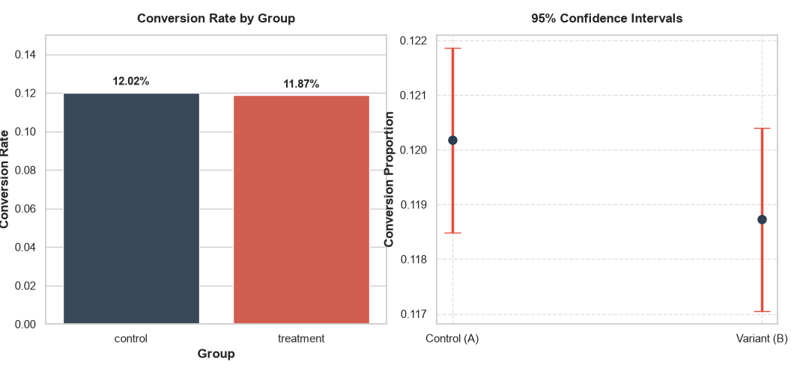

# A/B Testing — E-Commerce Conversion Analysis

## 📌 Overview

This project demonstrates how **A/B Testing** can be used to evaluate whether a change to an e-commerce website leads to a measurable difference in user conversion.

The analysis compares two groups:

* **Control Group (A):** Users who viewed the existing landing page.
* **Treatment Group (B):** Users who viewed the new landing page.

The goal is to determine whether the observed difference in conversion rates is statistically significant, rather than assuming that a difference in the data automatically means that one version caused the change.

---

## 🎯 Research Question

**Does the new landing page lead to a statistically significant change in conversion rate?**

---

## 📊 Dataset

The project uses an open-source e-commerce A/B testing dataset containing user-level experiment data.

Main columns:

| Column         | Description                                   |
| -------------- | --------------------------------------------- |
| `user_id`      | Unique user identifier                        |
| `timestamp`    | Time of the experiment session                |
| `group`        | Control or Treatment group                    |
| `landing_page` | Old or New landing page                       |
| `converted`    | Whether the user converted (`1`) or not (`0`) |

---

## 🔬 Methodology

The analysis follows these steps:

1. Load the dataset.
2. Inspect and clean the data.
3. Remove duplicate user/session records.
4. Calculate conversion rates for both groups.
5. Compare Control vs Treatment.
6. Perform a statistical significance test using a **two-proportion Z-test**.
7. Interpret the **p-value** using a significance level of `α = 0.05`.
8. Visualize the conversion rates.

### Hypotheses

**Null Hypothesis (H₀):**

There is no difference in conversion rates between the Control and Treatment groups.

**Alternative Hypothesis (H₁):**

There is a difference in conversion rates between the two groups.

---

## 📈 Results

### 📊 Conversion Rate Visualization

 

| Metric          | Control (A) | Treatment (B) |
| --------------- | ----------: | ------------: |
| Users           |     143,293 |       143,397 |
| Conversions     |      17,220 |        17,025 |
| Conversion Rate |      12.02% |        11.87% |

**Relative Difference (Lift):** `-1.20%`

**Z-Score:** `-1.1945`

**P-Value:** `0.23229`

Since the p-value is greater than `0.05`, the experiment does **not provide sufficient statistical evidence of a difference** between the two groups at the chosen significance level.

> A non-significant result does not prove that the two versions are identical. It means that this experiment did not provide strong enough evidence to conclude that their conversion rates differ.

---

## 💡 Key Learning

A/B testing is useful because it uses **randomized experimentation** to help isolate the effect of a specific change.

Unlike observational analysis, random assignment helps reduce the influence of confounding factors and provides a stronger basis for making causal claims.

### Correlation vs Causation

Observational data can reveal relationships between variables, but a relationship alone does not establish causation.

A well-designed randomized A/B test can provide stronger evidence about whether a specific change **caused** an observed difference.

---

## 🛠️ Technologies

* Python
* Pandas
* NumPy
* Matplotlib
* Seaborn
* Statsmodels

---

## ▶️ How to Run

Install the required dependencies:

```bash
pip install -r requirements.txt
```

Then run:

```bash
python live_code.py
```

If using `uv`:

```bash
uv run python live_code.py
```

---

## 📁 Project Structure

```text
ab
```
