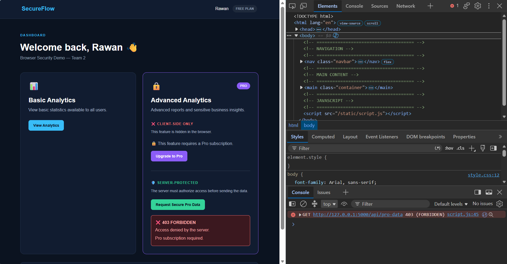
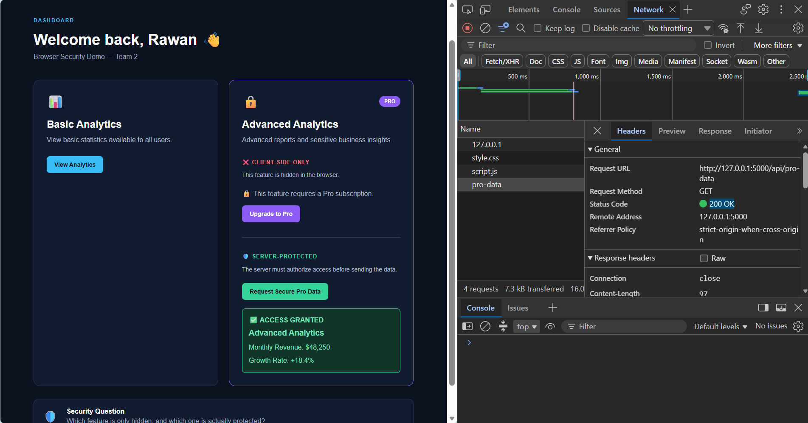

# Browser Security Demo

A simple Flask web application demonstrating an important web security principle:

> **Hidden does not mean protected.**

The project shows why sensitive features, permissions, and data should not rely only on browser-side controls and must be verified by the server.

This demo was created as part of **Week 3 of the AI Operations Specialist Practicum**.

---

## Project Objective

The goal of this demo is to answer a simple question:

**Can we trust the browser to protect sensitive features?**

The answer is **no**.

Anything sent to the browser can potentially be inspected or modified by the user using browser developer tools.

The demo compares two approaches:

```text
❌ Client-Side Hiding

vs.

✅ Server-Side Authorization
```

---

## How the Demo Works

The application contains an **Advanced Analytics** feature intended for Pro users.

The demo starts with a Free user:

```python
current_user = {
    "name": "Rawan",
    "plan": "free"
}
```

Two different implementations are demonstrated.

---

# 1. Insecure Example — Client-Side Hiding

In the first example, the Pro data is already included in the HTML but hidden using CSS.

```html
<div id="pro-content" class="hidden">
```

The CSS rule is:

```css
.hidden {
    display: none;
}
```

The page appears to protect the feature:

```text
🔒 This feature requires a Pro subscription.
```

However, the sensitive content has already been sent to the browser.

### Bypassing the UI

Open browser DevTools:

```text
Ctrl + Shift + I
```

Then:

```text
Elements
→ Ctrl + F
→ Search: pro-content
```

Find:

```html
<div id="pro-content" class="hidden">
```

Remove:

```text
hidden
```

The browser immediately reveals:

```text
💎 PRO FEATURE UNLOCKED

Revenue Insights

Monthly Revenue: $48,250
Growth Rate: +18.4%
```

The user did not actually become a Pro user.

Only the interface was modified.

### Result

```text
Hidden ≠ Protected
```

The browser already had the data, so CSS could only hide it visually.

---

# 2. Secure Example — Server-Side Authorization

The second example does not rely on the browser to decide whether access should be allowed.

Instead, JavaScript requests the protected data from the Flask server:

```javascript
fetch("/api/pro-data")
```

The server checks the user's plan:

```python
if current_user["plan"] != "pro":
    return jsonify({
        "error": "Forbidden",
        "message": "Pro subscription required."
    }), 403
```

The authorization decision therefore happens on the **server**, not in the browser.

---

## Free User — 403 Forbidden

With the server-side user configured as:

```python
current_user = {
    "name": "Rawan",
    "plan": "free"
}
```

Click:

```text
Request Secure Pro Data
```

The server rejects the request:

```text
❌ 403 FORBIDDEN

Access denied by the server.

Pro subscription required.
```

### Demo Result — Free User

When the user is on the Free plan, the server rejects the request with **403 Forbidden**.



The request can also be inspected using:

```text
DevTools
→ Network
→ pro-data
```

The HTTP response shows:

```text
Status Code: 403 Forbidden
```

Changing HTML or CSS in DevTools does not change this server decision.

---

## Pro User — 200 OK

For the second test, change the demo user's plan in `app.py`:

```python
current_user = {
    "name": "Rawan",
    "plan": "pro"
}
```

Save the file and request the secure data again.

The server now authorizes the request and returns:

```text
✅ ACCESS GRANTED

Advanced Analytics

Monthly Revenue: $48,250
Growth Rate: +18.4%
```

### Demo Result — Pro User

After changing the server-side user plan to Pro, the same request is authorized and the protected data is returned.



In the Network tab, the request now returns:

```text
Status Code: 200 OK
```

---

## Request Flow

### Free User

```text
Browser
   │
   │ GET /api/pro-data
   ▼
Flask Server
   │
   │ Check user plan
   ▼
Is user Pro?
   │
   NO
   │
   ▼
403 Forbidden ❌
```

### Pro User

```text
Browser
   │
   │ GET /api/pro-data
   ▼
Flask Server
   │
   │ Check user plan
   ▼
Is user Pro?
   │
   YES
   │
   ▼
200 OK ✅
   │
   ▼
Protected Data
```

---

## Insecure vs Secure

### ❌ Insecure

```text
Server
   ↓
Sends sensitive data
   ↓
Browser
   ↓
CSS hides the data
   ↓
User modifies HTML/CSS
   ↓
Data becomes visible
```

The problem is that the sensitive data was already sent to the browser.

### ✅ Secure

```text
Browser
   ↓
Requests protected data
   ↓
Server checks authorization
   ↓
FREE ─────→ 403 Forbidden

PRO ──────→ 200 OK
             ↓
          Pro Data
```

The server decides whether the data should be sent.

---

## Project Structure

```text
browser-security-demo/
│
├── app.py
├── requirements.txt
├── README.md
│
├── image/
│   ├── 403-forbidden.png
│   └── access-granted.png
│
├── templates/
│   └── index.html
│
└── static/
    ├── style.css
    └── script.js
```

### `app.py`

Runs the Flask server and contains the server-side authorization check.

### `templates/index.html`

Contains the application interface and the intentionally insecure client-side example.

### `static/style.css`

Contains the application styling and the `.hidden` CSS class used in the insecure demonstration.

### `static/script.js`

Sends the request to the protected Flask API and displays the server response.

### `image/`

Contains screenshots showing the two server-side authorization results:

- `403-forbidden.png` — Free user denied by the server.
- `access-granted.png` — Pro user successfully authorized.

---

# Running the Project

## 1. Create a Virtual Environment

Windows:

```bash
python -m venv .venv
```

## 2. Activate the Environment

PowerShell:

```powershell
.venv\Scripts\Activate.ps1
```

## 3. Install Dependencies

```bash
pip install -r requirements.txt
```

## 4. Start Flask

```bash
python app.py
```

Flask should display a local address similar to:

```text
http://127.0.0.1:5000
```

Open this address in the browser.

---

# Live Demo Steps

For a presentation, the demo can be performed in this order:

1. Start with the user configured as `free`.
2. Show that Advanced Analytics appears locked.
3. Open **DevTools → Elements**.
4. Search for `pro-content`.
5. Remove the `hidden` class.
6. Show that the supposedly locked content becomes visible.
7. Explain that the feature was **hidden, not protected**.
8. Click **Request Secure Pro Data**.
9. Show the server response: `403 Forbidden`.
10. Open **DevTools → Network** and verify the `403` response.
11. Change the server-side demo plan from `free` to `pro`.
12. Request the data again.
13. Show `200 OK` and **Access Granted**.

---

## Important Security Lesson

Client-side controls are useful for the user interface, but they should not be treated as a security boundary.

Important decisions such as:

- User permissions
- Feature access
- Prices
- Sensitive form values
- Protected data
- Administrative actions

should be validated or authorized by the server when appropriate.

> **The client can suggest. The server must decide.**

---

## Educational Simplification

This project intentionally uses a simplified server-side user:

```python
current_user = {
    "name": "Rawan",
    "plan": "free"
}
```

This is used only to make the authorization concept easy to demonstrate.

A production application would normally use a real authentication and authorization system such as authenticated sessions, secure tokens, user roles, and database-backed permissions.

---

## Technologies Used

- Python
- Flask
- HTML
- CSS
- JavaScript
- Browser DevTools
- HTTP status codes

---

## Disclaimer

This project is an educational security demonstration using local sample data.

It is designed to demonstrate secure application development concepts and should only be tested in environments you own or are authorized to use.
